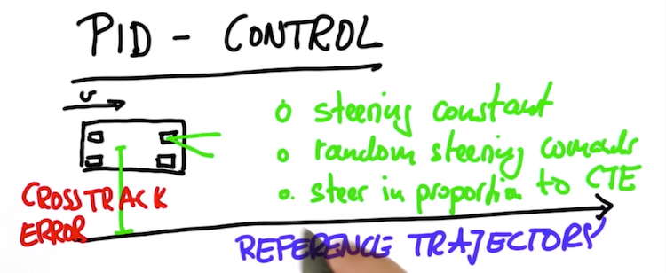
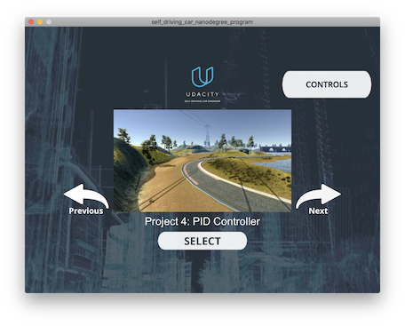
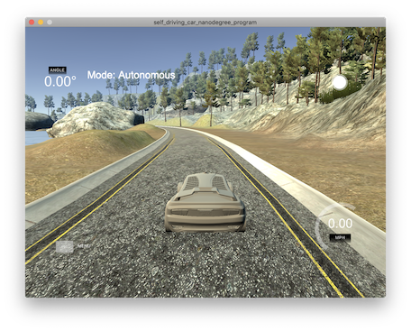
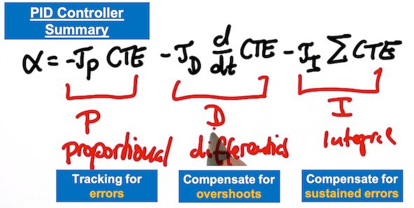
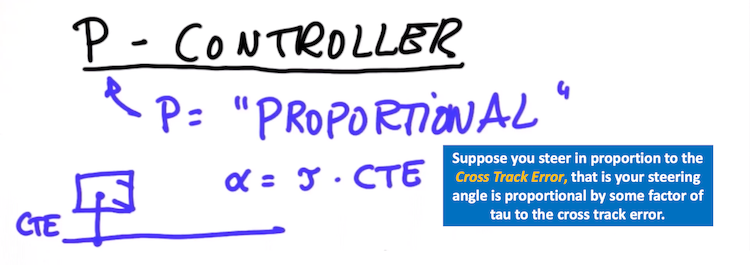
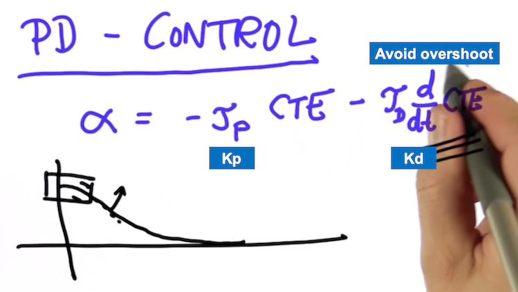
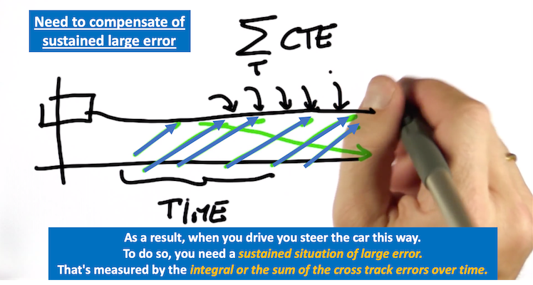
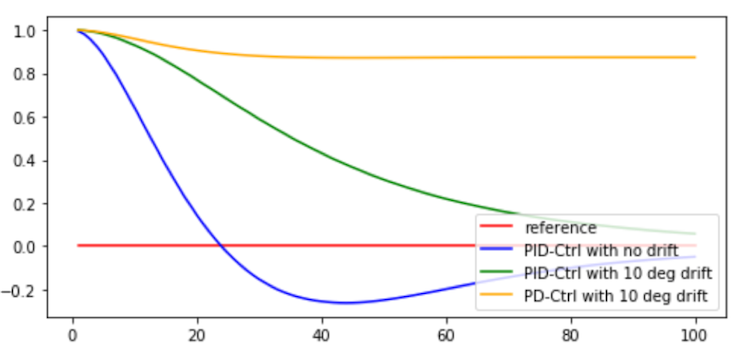

# PID Controller
</img><br>

## Project Background

In this project, PID controller is implemented to maneuver the vehicle around the lake race track by setting the steering angles in proportion to the cross track error (CTE), which is the lateral distance between the vehicle and reference trajectory, like one shown below.



## Controller Evaulation Environment

The vehicle simulator can be downloaded [here](https://github.com/udacity/self-driving-car-sim/releases).

This is what the simulation environment looks like.

| Simulator MENU   |  Lake Race Track   |
|----------------- | ------------------ |
|   |  

## Dependencies

* cmake >= 3.5
 * All OSes: [click here for installation instructions](https://cmake.org/install/)
* make >= 4.1(mac, linux), 3.81(Windows)
  * Linux: make is installed by default on most Linux distros
  * Mac: [install Xcode command line tools to get make](https://developer.apple.com/xcode/features/)
  * Windows: [Click here for installation instructions](http://gnuwin32.sourceforge.net/packages/make.htm)
* gcc/g++ >= 5.4
  * Linux: gcc / g++ is installed by default on most Linux distros
  * Mac: same deal as make - [install Xcode command line tools]((https://developer.apple.com/xcode/features/)
  * Windows: recommend using [MinGW](http://www.mingw.org/)
* [uWebSockets](https://github.com/uWebSockets/uWebSockets)
  * Run either `./install-mac.sh` or `./install-ubuntu.sh`.
  * If you install from source, checkout to commit `e94b6e1`, i.e.
    ```bash
    git clone https://github.com/uWebSockets/uWebSockets 
    cd uWebSockets
    git checkout e94b6e1
    ```
    Some function signatures have changed in v0.14.x. See [this PR](https://github.com/udacity/CarND-MPC-Project/pull/3) for more details.
* Simulator. You can download these from the [project intro page](https://github.com/udacity/self-driving-car-sim/releases) in the classroom.

Fellow students have put together a guide to Windows set-up for the project [here](https://s3-us-west-1.amazonaws.com/udacity-selfdrivingcar/files/Kidnapped_Vehicle_Windows_Setup.pdf) if the environment you have set up for the Sensor Fusion projects does not work for this project. There's also an experimental patch for windows in this [PR](https://github.com/udacity/CarND-PID-Control-Project/pull/3).

## Basic Build Instructions

1. Clone this repo.
2. Make a build directory: `mkdir build && cd build`
3. Compile: `cmake .. && make`
4. Run it: `./pid`. 

## PID Controllers

PID controllers are composed of three individual controller components:

- P for proportion control
- I for integral control
- D for differential control



Each of these components serve a specific purpose to aid the vehicle to track the desired steering angles in proportion to cross track error (CTE). 

Depends on the requirements of the steering angle tracking robustness performance to reject the noises in measurements and controls and bias, there are several PID controller variants can be considered. For example, we can first start from a simple implementation which contains only the P-controller that tracks the CTE, or a slightly more sophsicated PD controller which helps to dampen sharp steering angle changes, or an even more sophsicated PID controller which includes removal of system bias in additions to the benefits of PD controller.

### The P, Proportion Control

When the controller is proportion control, the steering angle is directly proportion to the CTE with a constant Kp. 
Given a CTE at one point of time, a large Kp value will give a larger maginitude of the command steering angles. In other words, when the Kp value is large, the vehicle becomes more sensitive to turn. Conversely, for a smaller Kp value, the vehicle is less sensitive to turn. Ideally, we want to find the largest Kp gain value that is sensitive enough to set steering angle to turn when moderate amount of CTE but not too large to cause the vehicle keep turning with small CTE (i.e. noises).



### The D, Differential Control

The differential control component in PID controller refers to the ability to react to the temporal derivative of the CTE. In other words, when the car has turned enough to reduce the CTE, it won't just go shooting for the x-axis but it will notice that it's already reducing the error. This error is becoming smaller over time.

The differntial control in additional to the proportion control (i.e. PD controller) allows the vehicle to gracefully approach the target trajectory when approriate Kd gain value is selected.

Note, unlike the P controller, the "D" term itself is not sufficient enough to be a practical controller. Here is an example of only having the differential control with different Kd values (1,10,100,1000). With small Kd gain value alone, despite it can help to steer the vehicle but often it is too late to steer the vehicle, as the differential term can only react to difference, which will be too late to compensate the steering when the large CTE is found.



### The I, Integral Control

The integral control is used to compensate the sustained large error. Unlike the P or the D control gains, it has less influence on setting the steering in proportion to the chaneg of CTE. Rather, the "I" control gain is used to help to combat the problem of the sustained large error (systematic bias). In other words, it compensates the steering angles to the constant (offset) error to the reference trajectory.



In real physical vehicle, we always have some bias in the steering angle due to variation of mechanical components amd this is when the integral gain term comes in handy to compensate this static or sustained error. Below is a comparison of the impact of different variant of PID controls with a 10deg of steering offset.



While the integral control is useful to compensate the sustain errors to the steering angle offset, the integral control does not work well on its own (i.e. without the P or PD controllers). With a relative small integral gain only, the controller will result in the vehicle spinning anti-clockwise (i.e. constant negative steering angles).

| Very small integral gains only         | Small integral gains only               |
|--------------------------------------- | --------------------------------------- |
|   |       |


In the simulated vehicle environment provided by Udacity's simulator, it was observed that very little impact of this integral control have an effect on the vehicle simulation, probably because of the simulated vehicle was already quite close to lane center at the start.


## PID Controller Tuning Strategy and Chosen Values

#### The chosen PID gain values are `Kp=0.15`, `Ki=0`, `Kd=2.5`

Now that we understand each of the P-I-D terms affects the performance of the maneuver / steering to the CTE, we can move on the general PID turning strategy. The goal of the PID control gains selection such that it is able to:

- Drive in a straight line
- Manuever the vehicle in corners

Note although it is possible to use the Twiddle method that Sebatisan Thurn mentioned in the lecture to optimize or tune the PID parameters, there are a number of practical reasons not to use the Twiddle method immediately to tune the PID parameters before some manual tuning because:

- Risks of the vehicle may leave the driable portion of the track surface if not montioring the simulation visually during the execution of twiddle parameters finding
- Risks of optimized parameters not converging depends on the specified values of base parameters, delta parameters given in each iteration
- Long time to run each iteration loop. To accurately determine the overall CTE, one has to measure the average CTE over one lap of race track, which unfortunately takes about 90 secs.

As discussed earlier, the P control gain is the most dominant term that could affect the straight line stability and sensitive to turn, the D control gain is used to dampen/soften immediatley after the (sharp) turn and the I control gain is to offset the system biase. Therefore, we can focus on tuning the PID controller in this order:

1. Find the best P control gain, Kp
2. Given the best P control gain found in Step 1, find the D control gain, Kd
3. Given the best P and D control gains found in the previous steps, explore the best value for I integral gain, Ki

Initially I set all the P,I,D control gains to be 0, essentially that means there are no controls, we can observe the vehicle maneuver behavior when PID controls are not present and use this as a baseline for the control improvements.

Then I experiment different values of Kp to get a sense of the impact of the dynamic changes. I started off with Kp=1 and observed that the vehicle keep oscillating left/right. So I took 1/2 of the previous Kp value at each step and observe at which Kp proportion gain value the vehicle stop oscillating. The idea is to pick a slightly large Kp value that has a little / reasonable steering oscillations, not the gain value that can perfectly drives in a straight line but failed to turn (aka understeer). The steering oscillations will be corrected using the Kd differential control gain.

| Small proportion gain                  | Large proportion gain                |
|--------------------------------------- |--------------------------------------|
|      |       |

In regards to the selection of the Kd, differential gain, before I start experimenting the best Kd differntial control gain, first I set the Kp=0.15 which was obtained in the Step 1. Then I started experimenting different Kp value in a large steps, for example Kd=(1,10,50,100,1000). And I found that with Kd=10 (in addition to Kp=0.15) performs well in steering, then I slowly reduce the value of the Kd by taking 1/2 at each step until the vehicle starting to oscillate left/right again. It was found that Kd of 2.5, 5 or 10 works reasonable well with prportion control gain (Kp=0.15) previously selected. I picked Kd=2.5 because this is the the smallest differential gain value that has just the sufficient compensation to correct the steering overshoot/oscillations.

| Small differential gain                | Large differential gain              |
|--------------------------------------- |--------------------------------------|
|         |    |

With the selection of Ki integral gain values, same as before I fixed the PD control gain obtained in the previous two steps (`Kp=0.15` and `Kd=2.5`), then I started experimenting the integral gain with the value of 1 and gradually scale the value of 1 by 10 in both increasing and decreasing directions. It was found that Ki=0,0.00001,0.0001 has little to no adverse effect in the vehicle maneuver. This is expected as the simulated vehicle environment was ideal and had very little to no system baise.

| No integral gain                            | Small integral gain                               |
|-------------------------------------------- |---------------------------------------------------|
||   |

## Video of steering the car using PID controller

[](videos/PID_Kp_0p15_Ki_0p0_Kd_2p5.mp4)
<center>Click the gif to see the video in MP4</center>
